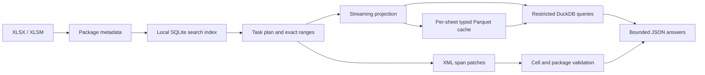

# Architecture and fidelity contract

## Why this design

SheetJet's primary boundary is **what reaches the agent**, not how large a prompt can
be. Tables stay local. Responses are constrained by cell, row and character budgets.
Each failure names the next useful action rather than returning incomplete numbers.
No embeddings, network service or LLM API is required for execution.

| Layer | Implementation | Cost / scope |
|---|---|---|
| Reconnaissance | ZIP directory, workbook relationships, early sheet XML, tables | No cell scan; dimensions are declared hints |
| Search | SQLite FTS5, lexical ranking, sheet-scoped incremental index | First scan is linear; repeated searches use disk index |
| Shared strings | Streaming import into SQLite with a 4,096-entry LRU | Avoids a million-entry Python string array |
| Ranges | lxml row streaming, projected cell decoding, 16-entry cache | Late rows still require earlier XML traversal |
| Formulas | Normalized vertical runs and lexical precedent tokens | No calculation; no complete dependency graph |
| Analytics | Expat scalar events, typed CSV-to-Parquet conversion, lazy DuckDB views | Exact numeric lexemes; no row trees or second data copy on cache load |
| Repeated scans | Explicit session materialization and reusable read-only connection | Pay for a local table once when repeated scans justify it |
| Multi-sheet queries | Header-name projection and provenance, union of selected ranges | Unrelated sheets excluded; per-sheet invalidation |
| Edits | Expat byte offsets, XML span replacement, compressed ZIP record copying | Recompress only changed parts; preserve opaque compressed records |
| Validation | Changed-sheet parse, expected cells, sheet/name/table identities, ZIP CRC/size | No whole-workbook cell-object reload |
| Disclosure | Compact JSON, hard budgets, separate full audit | No silent overflow truncation |

`Workbook` owns one package handle and reusable caches. Package size selects a
reported small/medium/large/huge strategy class. All classes use streaming paths;
there is no size-triggered full object-model load. Query memory is capped at 512 MB
by default for DuckDB (this is not a cap on total Python/process RSS). Range caches
and active SQL relations are session-local. Sheet indexes, shared strings and typed
Parquet projections persist in the chosen cache directory. The text index is opened
only when search or index-based inspection needs it. Data caches have no automatic
retention policy; callers can opt out per load or use temporary cache directories.

Index invalidation uses worksheet/table/shared-string ZIP CRCs and lengths plus
sheet visibility. Unchanged sheet data can reuse its index after other sheets change
at the same path. A source size/mtime/ctime change invalidates an active session.
CRCs are practical cache identities, not cryptographic defenses against malicious
collisions. Concurrent writers to a source workbook are unsupported.

Projection cache identities include the selected sheet/shared-string part signature,
range, column order, schema, formula-cache policy, effective table endpoint and format
version. Input filename is excluded: editing an assumption in a new output file does
not invalidate an untouched transaction sheet. A complete Parquet file is atomically
published after successful typed conversion. Invalid cache footers detected during
loading trigger a rebuild from the workbook. Lazy queries can encounter corrupt data
pages later; these fail instead of returning a partial answer. Remove that cache and
reopen to rebuild. A cache file replaced or removed during a session also fails closed.
This cache contains source-derived data; it is not a trust boundary
against local tampering. It never proves freshness of Excel's formula caches.

`load_sheets` takes explicit ranges and a common schema, stages only named columns,
aligns reordered headers, and adds source-sheet provenance. Each sheet is reusable
independently. Inputs with different units or meanings still require semantic review.

The scalar parser consumes 128 KiB XML chunks and queues only the rows produced by
that chunk. It recognizes namespace-qualified cell paths, omits phonetic annotations,
and retains numeric source text until SQL conversion. DTDs, duplicate projected cells,
out-of-order rows and cells with mismatched row coordinates are rejected. Projection
tests compare sparse mixed-type UTF-8/UTF-16 sheets against the existing tree decoder.

SQL sees views over exact projection files. A separate read-only connection permits
only those files through `allowed_paths`, disables other external access, and locks
configuration before executing user SQL. The connection stays open across queries
and is replaced when staging changes. A single SELECT and response budgets remain
mandatory. Loaded projections are local, trusted data; this is not a general hostile
SQL execution service. See DuckDB's [file access controls](https://duckdb.org/docs/stable/configuration/overview).

Parquet views let DuckDB push column selection and predicates into the scan without
copying the complete projection into another database. The explicit
`query_engine.materialize(name)` method makes a session-local table when repeated
scans justify that copy. It handles both one-sheet relations and multi-sheet unions;
a failed conversion preserves the published relation. The copy is removed when the
session closes. See DuckDB's [Parquet guidance](https://duckdb.org/docs/stable/data/parquet/overview).

## Preservation boundaries

The editor copies untouched ZIP local records verbatim through a streaming writer,
including compressed payloads, local headers and data descriptors. Central-directory
offsets are relocated; changed members alone are encoded with `zipfile`. The archive
module implements classic ZIP and ZIP64 offsets/counts without private `zipfile` APIs.
Tests exercise stored/deflated content, Unicode names, comments, data descriptors,
ZIP64 size/offset fields and a real 65,536-entry directory. Within
an edited worksheet, only cell spans, inserted row spans and an expanded dimension
are regenerated. Unrelated worksheet XML bytes remain identical. This preserves
unknown extensions that an object-model round trip might drop.

Content edits also set `fullCalcOnLoad` and `forceFullCalc`, and remove an existing
calculation chain and its package declarations. The original calculation mode is
retained. Cached dependent values and pivot/chart caches are not recomputed. Manual
calculation mode may still require an explicit recalculation in Excel.

The editor refuses a package bearing OOXML document signatures. VBA bytes are copied
without interpretation or execution. Native macro behavior is not verified by a
byte comparison. Existing charts, pivots, drawings, styles, names, links and other
opaque members are retained, but no native rendering or refresh is performed.

The audit stores before/after cell records, changed members, validation outcomes,
and SHA-256 digests of unchanged worksheet spans and copied compressed local records.
Unchanged member validation compares ZIP CRC and uncompressed lengths; regression
tests additionally compare compressed and decompressed bytes. The editor does not
decompress every untouched member to audit pre-existing corruption; byte retention
and complete input-health checks are different guarantees.
The output is validated in a temporary directory before atomic file replacement.
The workbook and audit are two files and cannot be committed as one filesystem
transaction; a filesystem failure between replacements can leave an output without
its audit. Consumers requiring transactional publication should wrap both in their
own artifact store.

## Scope of this release

Supported: transitional XLSX/XLSM; local inspection/search; range and table reads;
SQL analysis; formulas/styles/lexical precedents; scalar value/formula/style patches;
formula/style copying; adding cells and populated rows without shifting existing
coordinates; changed-range validation and auditable output.

Explicitly unsupported: XLS/XLSB, encrypted workbooks, strict OOXML, prefixed/SFX or
multi-disk ZIPs, unusual central-directory records, nonstandard
workbook part locations, Excel calculation, dependency-aware row/column shifts,
sheet renames, new/resized tables or charts, edits within shared/array formula groups,
table headers/totals, dynamic-array metadata cells and merged non-anchor cells.
Rich text is preserved when untouched; replacing a rich-text value replaces its runs.

Structural operations are rejected because preserving formulas alone is insufficient:
names, tables, charts and other dependencies also need translation. The
[openpyxl documentation](https://openpyxl.readthedocs.io/en/stable/editing_worksheets.html)
explicitly describes that dependency limitation. DuckDB performs the relational
work through its [Python API](https://duckdb.org/docs/stable/clients/python/overview).

## Extension priorities

1. Real, redistributable Excel-authored macro/pivot fixtures with native-Excel CI.
2. Table-aware structural edits with reference rewriting and preservation proofs.
3. A native parser backend retaining error, blank, date and formula-provenance contracts.
4. Cancellable queries and resource limits for service deployments.

These are roadmap items, not current capabilities.
